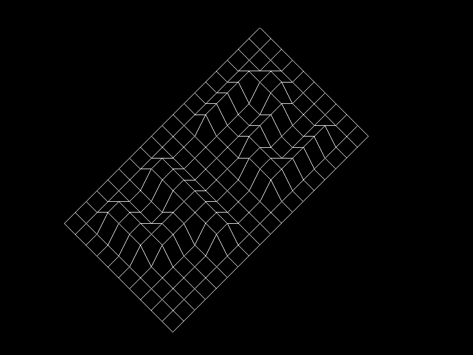

# λ-FdF
Reimplementing the FdF project from 42 in Haskell

> Disclaimer : I am still a complete beginner in fp, any PR or issue to help me improve this code is welcome !

### Controls
| Key                       | Action       |
|---------------------------|--------------|
| **Left Click**            | Move grid    |
| **Ctrl + hold left click**| Zoom on grid |
| **R**                     | Reset        |
| **Esc**                   | Quit         |

---

## Render example
